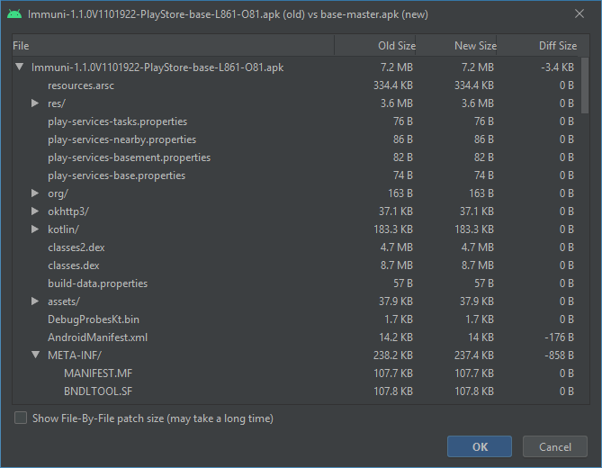
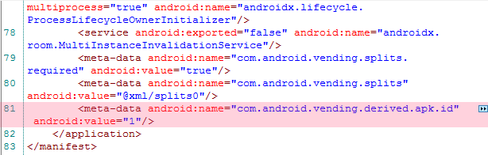
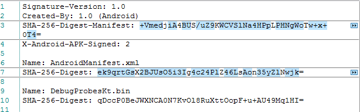
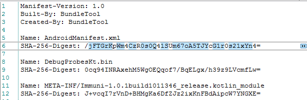
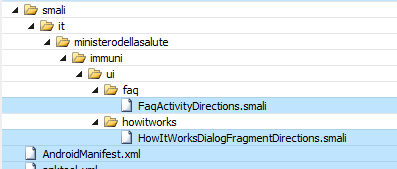
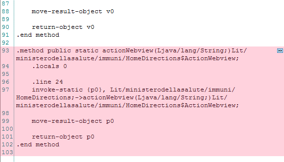

# Reproducible Build tests for Immuni
build 2.3.0 #2323941 -> _2 classes import mismatch_ \
. . . \
**build 1.1.0 #1101922 -> OK** \
build 1.0.2 #1021606 -> _2 classes import mismatch_ \
build 1.0.1 #1011346 -> _2 classes import mismatch_


Some instructions are officially provided by **Bending Spoons** on Immuni Documentation Repo - [HERE](https://github.com/immuni-app/immuni-documentation/blob/master/Technology.md#android).

## Preliminary Measures

- **1.** Manual declaration of BUILD_NUMBER in <project>/build.gradle in order to avoid any build-version mismatch

Play Store Release | Tag (Github) | <build_number>
-------------------|--------------|---------------
2.3.0 | Immuni-2.3.0build2323941 | 23941
. . . | . . .                    | . . .
1.1.0 | Immuni-1.1.0build1101922 | 1922
1.0.2 | Immuni-1.0.2build1021606 | 1606
1.0.1 | Immuni-1.0.1build1011346 | 1346

```
        computeVersionCode = { ->
            return (versionMajor * 1000000) + (versionMinor * 100000) + (versionPatch * 10000) + <build_number>
                    // Integer.valueOf(System.env.BUILD_NUMBER ?: 0)
        }
```

- **2.** Arrange package signature situation. There are 2 ways to do so.

(2A) Suggested : Generate your own certificate & arrange keystore/key params into <project>/template.properties

```
storeFile=<your_location/keystore.jks>
keyPassword=<your_key_password>
keyAlias=<your_key_alias>
storePassword=<your_keystore_password>
```

(2B) Comment certificate signing for release build variant in <project>/app/build.gradle

```
//    signingConfigs {
//        release {
//            keyAlias appProperties['keyAlias']
//            keyPassword appProperties['keyPassword']
//            storeFile file(appProperties['storeFile'])
//            storePassword appProperties['storePassword']
//        }
//    }
    defaultConfig {
        applicationId "it.ministerodellasalute.immuni"
        minSdkVersion rootProject.minSdkVersion
        targetSdkVersion rootProject.targetSdkVersion
        versionCode rootProject.versionCode
        versionName rootProject.versionName

        setProperty("archivesBaseName", "Immuni" + "-" + versionName + "build" + versionCode)

        testInstrumentationRunner "androidx.test.runner.AndroidJUnitRunner"
        vectorDrawables.useSupportLibrary = true
    }

    buildTypes {
        release {
            minifyEnabled false
            proguardFiles getDefaultProguardFile('proguard-android-optimize.txt'), 'proguard-rules.pro'
//            signingConfig signingConfigs.release
```
		
- **3.** Arrange environment settings & avoid to upgrade gradle plugin if/when suggested (keeping project default ones). These are the environment settings, that have been tested with **Android Studio 4.0** (Linux / Windows) and **Docker** (see attached Dockerfile) : 

Name | Version
-----|--------
Android Gradle Plugin | 3.6.3
Gradle | 5.6.4
JDK | 1.8
SDK | 29 (+23 not compulsory)
SDK Build-Tools | 29.0.3
NDK side-by-side | 20.0.5594570


---------------------------------------------

## Procedure

- Gradle sync & build signed aab bundle (2A) or unsigned aab bundle (2B) for Release variant

You can use Android Studio 4.0 or arrange your build-environment ( _release source download + signature arrangements + ./gradlew clean + ./gradlew bundleRelease_ ) on a Docker image using provided dockerfile .

- Connect your device through USB debug and use [Bundletool](https://developer.android.com/studio/command-line/bundletool) to create the JSON file

```
java -jar bundletool-all-0.15.0.jar get-device-spec --output=<json_filename>.json
```

- Extract specific APKs for your device from aab.

Build 2.3.0 #2323941

```
java -jar bundletool-all-0.15.0.jar build-apks --device-spec=<json_filename>.json --bundle=Immuni-2.3.0build2323941-release.aab --output=Immuni_2323941.apks --ks=<your_location/keystore.jks> --ks-pass=pass:<your_keystore_password> --ks-key-alias=<your_key_alias> --key-pass=pass:<your_key_password>
```
. . . \
Build 1.1.0 #1101922

```
java -jar bundletool-all-0.15.0.jar build-apks --device-spec=<json_filename>.json --bundle=Immuni-1.1.0build1101922-release.aab --output=Immuni_1101922.apks --ks=<your_location/keystore.jks> --ks-pass=pass:<your_keystore_password> --ks-key-alias=<your_key_alias> --key-pass=pass:<your_key_password>
```

Build 1.0.2 #1021606

```
java -jar bundletool-all-0.15.0.jar build-apks --device-spec=<json_filename>.json --bundle=Immuni-1.0.2build1021606-release.aab --output=Immuni_1021606.apks --ks=<your_location/keystore.jks> --ks-pass=pass:<your_keystore_password> --ks-key-alias=<your_key_alias> --key-pass=pass:<your_key_password>
```

Build 1.0.1 #1011346

```
java -jar bundletool-all-0.15.0.jar build-apks --device-spec=<json_filename>.json --bundle=Immuni-1.0.1build1011346-release.aab --output=Immuni_1011346.apks --ks=<your_location/keystore.jks> --ks-pass=pass:<your_keystore_password> --ks-key-alias=<your_key_alias> --key-pass=pass:<your_key_password>
```

- Locate APKs on your device & extract them through ADB pull, Amaze, etc.

```
adb shell pm path it.ministerodellasalute.immuni
```

--------------------------------------

## Comparison

You can use Android Studio APK Analyzer, Python script apkdiff, APK extraction & smali comparison, etc. .

**Everything OK with build 1.1.0** - read classes mismatch notice for builds 1.0.1 & 1.0.2 .



Keep in mind that these files won't ever match :

- AndroidManifest.xml ( _changes performed by Google Play during app publishing_ )



- META-INF/BNDLTOOL.RSA ( _different sign certificate_ )

- META-INF/BNDLTOOL.SF ( _different SHA-256-Digest for AndroidManifest.xml_ )



- META-INF/MANIFEST.MF ( _different SHA-256-Digest for AndroidManifest.xml_ )



--------------------------------------

## Classes.dex mismatch situation of releases 1.0.1 & 1.0.2 & . . . & 2.3.0

Owing to import mapping issues there is a mismatch between Classes.dex files of such releases = Play Store versions of 1.0.1 & 1.0.2 have 636 Bytes more than compiled ones.

For such releases there is indeed the import of _it.ministerodellasalute.immuni.HowitworksDirections instead of it.ministerodellasalute.immuni.HomeDirections_ in generated FaqActivityDirections.java and HowitworksDialogFragmentDirections.java, that leads to missing method calls.

Wrong import

```
import it.ministerodellasalute.immuni.HowitworksDirections;
```

Right import

```
import it.ministerodellasalute.immuni.HomeDirections;
import it.ministerodellasalute.immuni.HomeDirections.ActionHowitworks;
import it.ministerodellasalute.immuni.HomeDirections.ActionOnboardingActivity;
import it.ministerodellasalute.immuni.HomeDirections.ActionWebview;
```

 



It's a source issue between annotations management and environment settings&plugins alignment. Clean+Rebuild, Gradle/Environment Cache resets, starting from scratch on other systems, etc. don't fix it. 

Such situation had been fixed by **Bending Spoons** on build 1.1.0 = OK Reproducible Builds for such release. However, it has been found again with next releases, including latest 2.3.0 .
